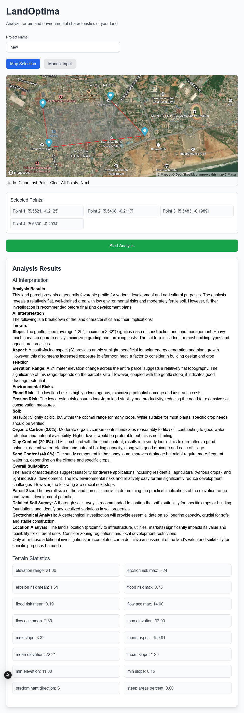

# LandOptima

LandOptima is a comprehensive land analysis tool that combines **geospatial data processing**, **environmental risk assessment**, and **AI-powered insights** to help users evaluate land characteristics for various purposes, such as agriculture, construction, or environmental planning. It provides detailed terrain analysis, soil quality data, flood and erosion risk assessments, and AI-generated interpretations to make informed decisions about land use.

---

## Features

### Backend (Flask API)
- **DEM Processing**: Fetch DEM (Digital Elevation Model) data from OpenTopography based on geographic boundaries.
- **Terrain Analysis**: Calculate slope, aspect, flow accumulation, flood risk, and erosion risk.
- **Soil Data Integration**: Fetch soil data (clay, sand, organic carbon, pH) from the SoilGrids API.
- **Environmental Risk Assessment**: Evaluate flood and erosion risks based on terrain and soil data.
- **AI Interpretation**: Generate natural language interpretations of land characteristics using Google's Gemini AI.


### Frontend (React App)
- **Interactive Map**: Draw boundaries on a map to define the land area for analysis.
- **Real-Time Analysis**: Submit land boundaries and project details to the backend for analysis.
- **AI-Powered Insights**: Display AI-generated interpretations of land characteristics.
- **Terrain Statistics**: Visualize key metrics such as elevation, slope, aspect, flood risk, and erosion risk.
- **Error Handling**: Display user-friendly error messages for invalid inputs or API failures.

---


## Requirements

### Backend
- Python 3.8+
- Flask
- Flask-CORS
- Rasterio
- NumPy
- WhiteboxTools
- Google Generative AI SDK
- Requests

### Frontend
- React
- ReactMarkdown (for rendering AI-generated markdown content)
- Mapbox

---

## Installation

### Backend
1. Clone the repository:
   ```bash
   git clone https://github.com/yourusername/LandOptima.git
   cd LandOptima/flask
   ```

2. Install dependencies:
   ```bash
   pip install -r requirements.txt
   ```

3. Set up environment variables:
   Create a `.env` file in the `backend` directory and add the following:
   ```plaintext
   OPENTOPO_API_KEY=your_opentopography_api_key
   GEMINI_API_KEY=your_google_gemini_api_key
   ```

4. Run the Flask app:
   ```bash
   python app.py
   ```

### Frontend
1. Navigate to the `frontend` directory:
   ```bash
   cd ../frontend/landoptima
   ```

2. Install dependencies:
   ```bash
   npm install
   ```

3. Start the development server:
   ```bash
   npm start
   ```

---

## Usage

1. **Define Land Boundaries**:
   - Use the interactive map to draw a polygon or manually input coordinates in JSON format.

2. **Enter Project Name and Boundary**:
   - Provide a name and boundary of the land parcel using the map or manual input for your project to identify the analysis results.


3. **Start Analysis**:
   - Click the "Start Analysis" button to submit the data to the backend.

4. **View Results**:
   - The AI-generated interpretation and terrain statistics will be displayed on the results page.

---

## Example API Request

### Request
```json
POST /analyze-land
{
    "projectName": "Sample Project",
    "boundaries": [
        [37.7749, -122.4194],
        [37.7849, -122.4294],
        [37.7949, -122.4394]
    ]
}
```

### Response
```json
{
    "message": "Land analysis completed successfully",
    "statistics": {
        "min_elevation": 10.5,
        "max_elevation": 50.3,
        "mean_slope": 5.2,
        "flood_risk_mean": 0.15,
        "erosion_risk_mean": 12.7
    },
    "environmental_assessment": {
        "flood_risk": {
            "level": "Low",
            "contributing_factors": []
        },
        "erosion_risk": {
            "level": "Moderate",
            "contributing_factors": ["Steep slopes"]
        },
        "soil_quality": {
            "ph": 6.5,
            "organic_carbon": 2.0,
            "texture": {
                "clay": 20.0,
                "sand": 40.0
            }
        }
    },
    "ai_interpretation": "This land parcel presents a generally favorable profile for most development and agricultural purposes..."
}
```

---

## Contributing

Contributions are welcome! Please follow these steps:
1. Fork the repository.
2. Create a new branch for your feature or bugfix.
3. Submit a pull request with a detailed description of your changes.

---


## Acknowledgments
- **OpenTopography** for providing DEM data.
- **SoilGrids** for soil property data.
- **Google Gemini AI** for natural language interpretation.
- **WhiteboxTools** for terrain analysis tools.
- **Mapbox** for map creation.


---

## Contact

For questions or feedback, please contact kelvinnuamah123@gmail.com
